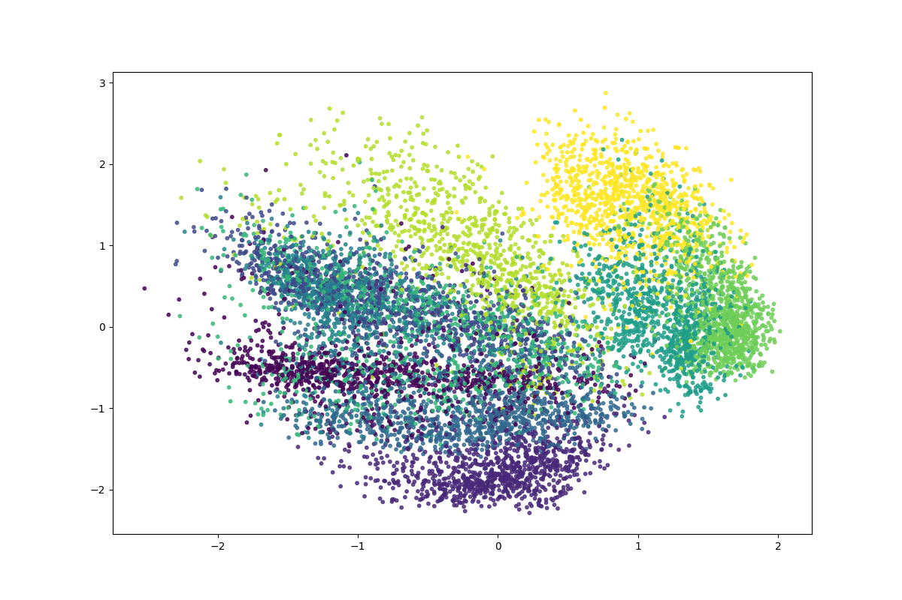

# generative-models

experiments with generative models.

A study of generative models using [David Foster's book](https://www.amazon.com/Generative-Deep-Learning-Teaching-Machines/dp/1098134184/ref=asc_df_1098134184/?tag=hyprod-20&linkCode=df0&hvadid=632163212339&hvpos=&hvnetw=g&hvrand=6398669216922269101&hvpone=&hvptwo=&hvqmt=&hvdev=c&hvdvcmdl=&hvlocint=&hvlocphy=9031944&hvtargid=pla-1852750701094&psc=1) as a guide. Also, implementing with torch instead of TF keras.

- [X] VAE (code needs cleaning though)
- [ ] Autoregressive models
- [ ] Normalizing flow models
- [ ] Energy-based models
- [ ] Diffusion models
- [ ] Music generation
- [ ] World models
- [ ] Multimodal models

