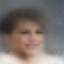
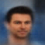

# generative-models

A study of generative models.

- [X] VAEs
- [ ] Autoregressive models
- [ ] Normalizing flow models
- [ ] Energy-based models
- [ ] Diffusion models
- [ ] Music generation
- [ ] World models
- [ ] Multimodal models

VAE trained on [CelebA](https://mmlab.ie.cuhk.edu.hk/projects/CelebA.html
):

VAE latent space with class labels on FashionMNIST:

